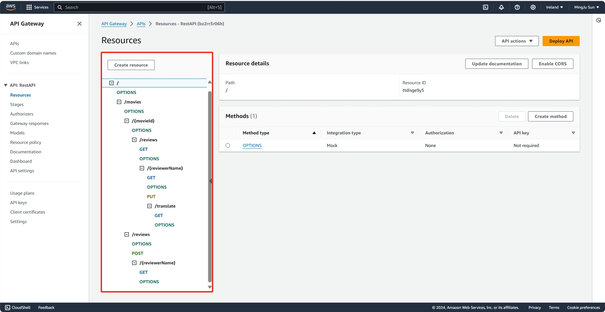
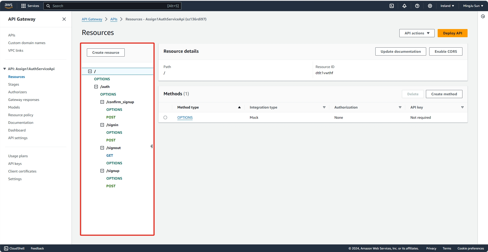
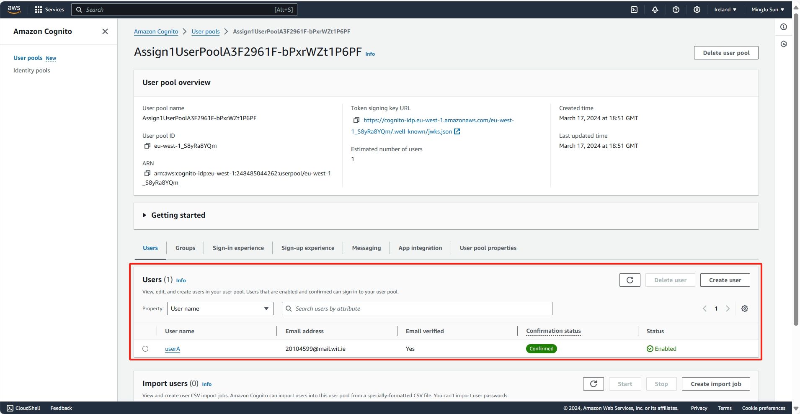

## Serverless REST Assignment.

__Name:__ MingJu Sun

__Video demonstration:__ https://youtu.be/-7rEICh9D0s

This repository contains an implementation of a serverless REST API for the AWS platform. The CDK framework is used to provision its infrastructure. The API's domain context is movie reviews.

### API endpoints.

__App API:__
+ POST /movies/reviews - Add a review to a movie. **[Requires Authentication]**
+ GET /movies/reviews/{reviewerName} - Get all reviews written by a specific reviewer (across all movies)
+ GET /movies/{movieId}/reviews - Get all reviews for a specific movie.
+ GET /movies/{movieId}/reviews?minRating=n - Get all reviews for a specific movie with a rating greater than or equal to the specified minimum rating.
+ GET /movies/{movieId}/reviews/{reviewerName} - Get a review for a specific movie written by an input reviwerName.
+ GET /movies/{movieId}/reviews/{year} - Get all reviews for a specific movie written during an input year.
    + This endpoint shares a lambda call with the above {reviewerName} endpoint, the input of which is determined through regex.
+ PUT /movies/{movieId}/reviews/{reviewerName} - Update a specific review's content. **[Requires Authentication]**
+ GET /movies/{movieId}/reviews/{reviewerName}/translate?language=xx - Translate a review's content into a specified langauge

__Auth API:__

+ POST /auth/signup - Register for an account.
+ POST /auth/confirm_signup - Confirm account registration with confirmation code.
+ POST /auth/signin - Sign into an account/authenticate.
+ GET /auth/signout - Sign out of an account/deauthenticate.

### Authentication.

### Independent learning (If relevant).

+ Functionality: Review translations:
    + Files of evidence:
        + lambda/translateReview.ts

+ Infrastructure: Lamdbd layers or Multi-stack app:
    + Files of evidence:
        + lib/app-api.ts
        + lib/auth-api.ts
        + lib/ds-assignment1-stack.ts        